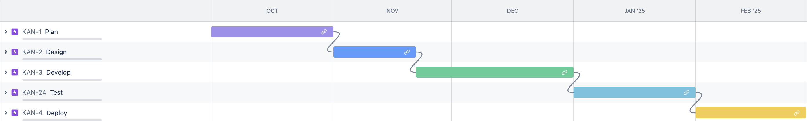
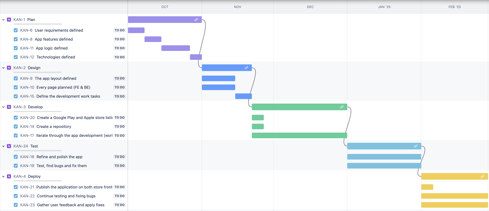
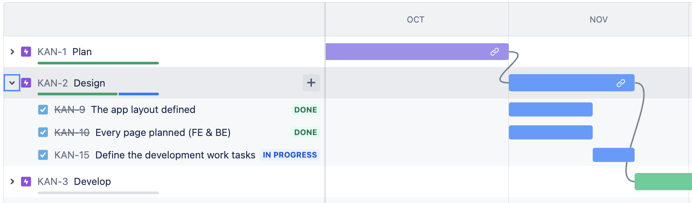
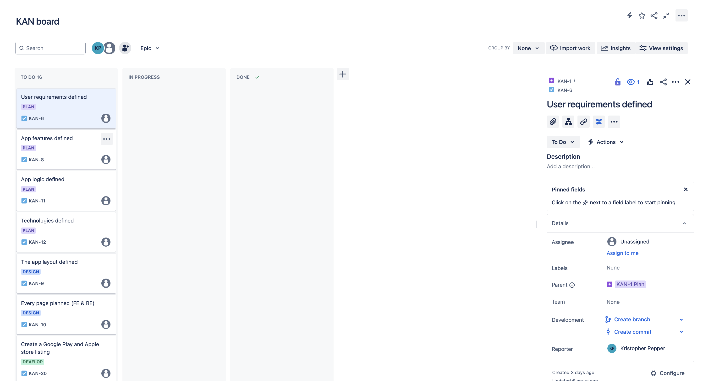

# Jira

## About

- In this repository I will document different tasks being perfomed in Jira

---

## Project X

About

  
- Project X is a fictional app development project
- The project is oriented around a small team of developers

Timeline

- The screenshot below shows the Jira project timeline
- The project is divided into 5 different epics, with each one representing a different stage in the project
- Each epic is dependent on the previous one being completed beforehand
  

  

- The screenshot below shows the same project timeline with the epics expanded
- Each epic has multiple child issues
- Some must be completed in order, while some occur simultaneously
  

  

- The screenshot below shows the timeline while the project is under way
- The Plan epic has been finished and the Design epic is mid way
  

Board

- The screenshot below shows the inital Projext X board
- All of the child issues can be seen in a chronological list going down the page (the list continues off screen)

 

